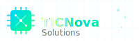

# TICNova Solutions - Sitio Web Corporativo



## 🌐 Sitio Web: [tnovasolutions.com](https://tnovasolutions.com)

Sitio web profesional y moderno para TICNova Solutions, una empresa de consultoría tecnológica especializada en desarrollo de software, arquitectura de sistemas, administración de bases de datos e infraestructura en la nube.

## 🏢 Sobre la Empresa

**TICNova Solutions** es una empresa de consultoría tecnológica que ofrece:

- **Consultoría tecnológica integral**
- **Desarrollo de software** (Web, Desktop y en la nube)
- **Arquitectura de sistemas** y optimización de infraestructura
- **Administración y seguridad** de bases de datos
- **Integración de sistemas** empresariales (ERP, CRM, plataformas médicas)

### 🏭 Subsidiarias

1. **SolarNova Energy** - Especializada en energías renovables y sistemas solares
2. **AutoSense IoT** - Especializada en automatización de procesos y soluciones IoT

## 🚀 Características del Sitio Web

### ✨ Diseño y UX
- **Diseño responsivo** - Mobile-first approach
- **Navegación intuitiva** con menú hamburguesa en móviles
- **Animaciones suaves** y efectos visuales modernos
- **Paleta de colores tecnológica** (cian, verde neón, azul oscuro)
- **Tipografía moderna** con fuente Inter

### 🎨 Secciones
- **🏠 Inicio** - Hero section con call-to-actions
- **⚙️ Servicios** - 6 servicios principales con iconos
- **🏭 Subsidiarias** - SolarNova Energy y AutoSense IoT
- **👥 Sobre Nosotros** - Historia, valores y equipo de liderazgo
- **📊 Proyectos** - Casos de éxito destacados
- **📞 Contacto** - Formulario funcional y información de contacto

### 🔧 Funcionalidades
- **Navegación suave** entre secciones
- **Formulario de contacto** con validación
- **Efectos parallax** en elementos flotantes
- **Contadores animados** para estadísticas
- **Sistema de notificaciones** para el usuario
- **Botón scroll-to-top**
- **Efectos de escritura** en el título principal

## 🛠️ Tecnologías Utilizadas

- **HTML5** - Estructura semántica
- **CSS3** - Diseño responsivo con Grid y Flexbox
- **JavaScript (ES6+)** - Funcionalidades interactivas
- **SVG** - Logos y iconos escalables
- **Font Awesome** - Iconografía
- **Google Fonts** - Tipografía Inter

### ✨ Sin Dependencias
- **🚫 Sin Node.js** - Sitio web estático puro
- **🚫 Sin Build Process** - No requiere compilación
- **🚫 Sin Package Managers** - Solo archivos estáticos
- **✅ Deploy Directo** - Sube y funciona

## 📁 Estructura del Proyecto

```
tnovasolutions-website/
├── index.html              # Página principal
├── styles.css              # Estilos CSS
├── script.js               # JavaScript
├── logo.svg                # Logo principal
├── logo-compact.svg        # Logo compacto para navegación
├── favicon.svg             # Favicon
├── robots.txt              # Configuración para buscadores
├── sitemap.xml             # Mapa del sitio
├── domain-config.md        # Configuración del dominio
├── README-LOGOS.md         # Documentación de logos
└── README.md               # Este archivo
```

## 🚀 Instalación y Uso

### Requisitos
- **Navegador web moderno** (Chrome, Firefox, Safari, Edge)
- **Servidor web** (solo para desarrollo local)

### Instalación Local
1. **Clona el repositorio:**
```bash
git clone https://github.com/va6046/tnovasolutions.git
cd tnovasolutions
```

2. **Abre directamente en el navegador:**
```bash
# Opción 1: Doble clic en index.html
# Opción 2: Arrastra index.html al navegador
```

3. **O usa un servidor local (recomendado):**
```bash
# Con Python
python -m http.server 8000

# Con PHP
php -S localhost:8000

# Con cualquier servidor web
# Simplemente apunta al directorio del proyecto
```

4. **Visita `http://localhost:8000` en tu navegador**

### 🎯 Deploy Directo
- **GitHub Pages:** Push y listo
- **Netlify:** Arrastra la carpeta
- **Vercel:** Conecta el repositorio
- **Cualquier hosting:** Sube los archivos

## 📱 Responsive Design

El sitio está optimizado para:
- **📱 Móviles** (< 480px)
- **📱 Tablets** (480px - 768px)
- **💻 Desktop** (> 768px)

## 🎯 SEO Optimizado

- ✅ Meta tags completos
- ✅ Open Graph tags
- ✅ Estructura semántica HTML5
- ✅ Alt texts en imágenes
- ✅ Sitemap XML
- ✅ Robots.txt configurado
- ✅ URLs amigables

## 🎨 Logos y Branding

El proyecto incluye un sistema completo de logos:
- **Logo principal** (200x60px) - Para headers y documentos
- **Logo compacto** (120x40px) - Para navegación
- **Favicon** (32x32px) - Para navegadores

Ver [README-LOGOS.md](README-LOGOS.md) para más detalles.

## 📧 Contacto

- **Email:** info@tnovasolutions.com
- **Sitio Web:** [tnovasolutions.com](https://tnovasolutions.com)

## 📄 Licencia

Este proyecto es propiedad de TICNova Solutions. Todos los derechos reservados.

## 🤝 Contribuciones

Este es un proyecto corporativo. Para contribuciones o modificaciones, contactar al equipo de desarrollo.

---

**Desarrollado con ❤️ para TICNova Solutions - 2024**

